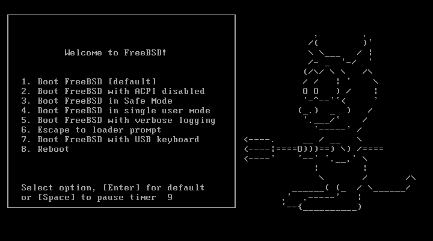

## FreeBSD Reset or Recover Root Password

[FreeBSD reset password](https://www.cyberciti.biz/tips/howto-freebsd-reset-recover-root-password.html).

#### Procedure: Reset FreeBSD root user password

Step # 1: Start FreeBSD server/workstation.

Step # 2: Press Enter key at boot loader.

At Welcome to FreeBSD! boot menu press spacebar key to pause default booting

Type number 4 key (type 4 number) to boot into **single user mode**



Next you will see the following prompt from system:

`When prompted Enter full pathname of shell or RETURN for /bin/sh:`

Press **Enter key** to boot into a single user mode. Next, you will be immediately dropped into a single user mode without a root password.

You need to remount / (root) file system in read and write mode with mount command, type the following commands:

```
# mount -u /
# mount -a
```

Setup a new password with the passwd command for root user:

```
# passwd
```

Next type exit command to boot FreeBSD into multi-user mode environment:

```
# exit
```

OR You can just reboot the system:

```
# sync;sync
# reboot
```

For more information see man pages of passwd and mount commands.

## How To Add and Remove Users on FreeBSD

[Add/Remove Users](https://www.digitalocean.com/community/tutorials/how-to-add-and-remove-users-on-freebsd).

#### Introduction

On FreeBSD, like other Unix-like OSes, user accounts can be created to provide interactive access to the system. User accounts, when managed properly, can add a layer of system security by providing a way to limit individual user’s access to only the files and directories that it needs to accomplish its tasks.

In this tutorial, we will show you how to perform the following user management tasks on a FreeBSD server:

```
How To:
    Add a user
    Grant superuser privileges
    Remove a user
    Lock a user account
    Unlock a user account
```

#### How To Add a User

To add a user with adduser in interactive mode, which allows you to create one user at a time, simply run the command without arguments like this:

```
sudo adduser
```

At this point, you must provide information about the new user by responding to the series of prompts. Let’s take a look at an example of the prompts now, with example responses shown in red:

```
Username: gamer
Full name: Gamer
Uid (Leave empty for default):
Login group [gamer]:
Login group is gamer. Invite gamer into other groups? []: wheel
Login class [default]:
Shell (sh csh tcsh nologin) [sh]:
Home directory [/home/gamer]:
Home directory permissions (Leave empty for default):
Use password-based authentication? [yes]:
Use an empty password? (yes/no) [no]:
Use a random password? (yes/no) [no]:
Enter password: password
Enter password again: password
Lock out the account after creation? [no]:
```

After answering the prompts, a summary of the new user will be displayed:

```
Username   : gamer
Password   : *****
Full Name  : Gamer
Uid        : 1002
Class      :
Groups     : gamer wheel
Home       : /home/gamer
Home Mode  :
Shell      : /bin/sh
Locked     : no
OK? (yes/no): yes
```

If you respond yes, the user will be created and a confirmation will be provided:

```
adduser: INFO: Successfully added (gamer) to the user database.
```

Whether you create the user or not, you will see the following prompt:

```
Add another user? (yes/no): no
Goodbye!
```

#### How To Grant Sudo Privileges

On FreeBSD, like other Unix-like OSes, you may grant users with the ability to run commands with superuser privileges via the `sudo` command. The `sudo` command allows a user to run a command as another user. We will show you how to grant a normal user with superuser privileges, effectively allowing them to execute commands as `root`.

On FreeBSD, users that are members of the `wheel` group are allowed to use `sudo`. This is due to the following line in the default **sudoers** file,

While in **single user mode** on bootup:
`vi /usr/local/etc/sudoers`:

```
Uncomment to allow members of group wheel to execute any command
%wheel ALL=(ALL) ALL
```

#### How To Remove a User

An easy way to remove a user from your FreeBSD system is to use the `rmuser` command. You may run it with no arguments, or pass the users you want to remove as arguments, and follow the prompts to complete the user removal process:

```
sudo rmuser
```

If you do not provide a user name as an argument, you will be prompted for one or more. Then you will be asked to confirm if you’re sure and if the user’s home directory should be removed:

```
Please enter one or more usernames: gamer
Matching password entry:

gamer:*:1002:1002::0:0:Gamer:/home/gamer:/bin/sh

Is this the entry you wish to remove? y
Remove user's home directory (/home/gamer)? y
Removing user (gamer): mailspool home passwd.
```

#### How To Lock a User Account

If you want to disable a user’s access to the system but not delete their account records and home directory, you may lock the account. The easiest way to disable a user is to use the `pw lock` command, with the user that you want to disable as an argument, like so:

```
sudo pw lock username
```

This command works by prepending “_LOCKED_” to the user’s entry in the `/etc/master.passwd` file.

The user will be unable to log in until the account is unlocked.

#### How To Unlock a User

If you want to enable a user that was disabled with `pw lock`, you can use the`pw unlock`command to do so:

```
sudo pw unlock username
```

This command works by deleting “_LOCKED_”, if present, from the user’s entry in the`/etc/master.passwd` file.

#### Conclusion

You should now have a good understanding of basic user management on a FreeBSD server.
